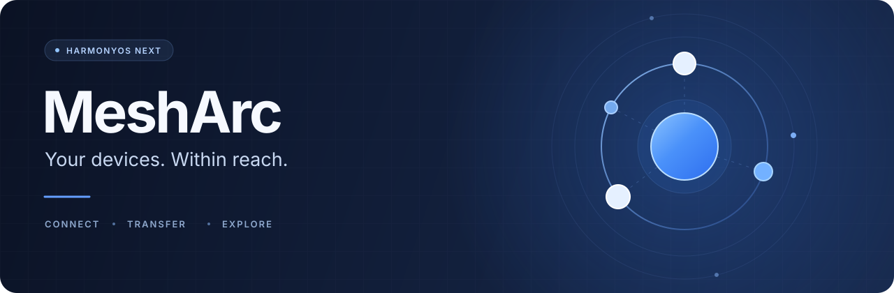

  

<h1 align="center">MeshArc</h1>

<strong>Bring your devices within reach.</strong> 
A native Tailscale community client for HarmonyOS NEXT. 
Connect your devices, transfer files, and access remote storage and media.

  
  
  

  <a href="#features">Features</a> ·
  <a href="#start">Get started</a> ·
  <a href="#compatibility">Compatibility</a> ·
  <a href="docs/development.md">Development</a> ·
  <a href="https://github.com/flypigJ/Tailscale-OHOS/issues">Report an issue</a>

---

Reach your NAS away from home, send a file from your phone to your computer, or open a remote media library. MeshArc brings these everyday actions into a native HarmonyOS interface and connects your device to your existing Tailscale network, or tailnet.

**MeshArc is an independent community project, not an official Tailscale client.** The application is called MeshArc; the repository retains the name `Tailscale-OHOS`.

## One connection. More possibilities.

| What you want to do | What MeshArc provides |
| --- | --- |
| **Reach your devices** | Sign in to Tailscale, inspect device availability, connection paths and latency, and access services by Tailscale IP. |
| **Use a remote network** | Select an available exit node, accept approved subnet routes, and configure LAN access while using an exit node. |
| **Move files between devices** | MeshSend integrates Taildrop sending and receiving, with an additional LocalSend service integration; follow progress, cancel, retry and manage received files. |
| **Browse remote storage** | Browse authorized Taildrive shares and upload or download files. Available operations depend on share permissions. |
| **Open your media library** | Detect Jellyfin, Emby and Plex services and hand server details to HosPlayer. Sign in to your media account inside the player. |
| **Protect access on your device** | App Lock and Taildrive Folder Lock use system authentication to protect access inside MeshArc; they do not replace remote share permissions. |
| **Feel at home on HarmonyOS** | Native ArkUI, Chinese and English, light and dark themes, and adaptive layouts for phones, tablets and 2in1 devices. |

This overview describes the public source tree. AppGallery releases, development branches and historical packages may differ; check the release notes for the version you install.

## Get started

### 1. Get MeshArc

**[Get MeshArc on Huawei AppGallery →](https://appgallery.huawei.com/app/detail?id=io.github.tailscaleohos)**

Check device eligibility in AppGallery. The source project targets **HarmonyOS 6.1 / API 23 and arm64**; the store listing is the reference for the requirements of the distributed version.

[GitHub Releases](https://github.com/flypigJ/Tailscale-OHOS/releases) also retains historical builds. The early `0.3.19-release` HAP uses a development provisioning profile, is not universally installable, and does not include every feature in the current source tree. Check each release's notes for installation conditions. To build your own package, see the [development guide](docs/development.md).

### 2. Join your network

1. Install and configure [Tailscale](https://tailscale.com/download) on the computers, NAS devices or servers you want to access.
2. Open MeshArc and complete browser sign-in with an account in the same tailnet.
3. Connect, approve the HarmonyOS VPN prompt, and wait for the connection to become ready.
4. Choose a device to access a service, send files, or browse an existing Taildrive share.

Exit nodes, subnet routes, Taildrop and Taildrive require the corresponding remote services and access permissions. MeshArc does not expose remote services or change your tailnet access policy for you.

## Compatibility and current limits

| Area | Current status |
| --- | --- |
| Platform | Source baseline: HarmonyOS 6.1 / API 23; native library: arm64. The module declares phone, tablet and 2in1 support; recorded network validation has primarily used a physical phone. |
| Tailscale engine | Pinned to `1.86.5` for the OpenHarmony Go 1.24 toolchain. |
| MagicDNS | Not enabled. Use Tailscale IP addresses; the VPN does not publish Tailscale DNS servers or search domains. |
| Device reboot | No automatic startup. Open the app after a reboot and reconnect the VPN manually. |
| Other VPNs | Disconnect other system VPNs before connecting; an existing VPN may prevent authorization or connection. |
| LiveView | Traffic LiveView is not available; it depends on the required platform entitlement. |
| Background connection | Screen-off, network-transition and long-session reliability remain active areas of work. Include your device and OS version when reporting problems. |

## Documentation and contributing

| Resource | What you will find |
| --- | --- |
| [Development guide](docs/development.md) | Architecture, prerequisites, builds, signing boundaries and device checks. |
| [Contributing](CONTRIBUTING.md) | Bug reports, documentation, translations and code contributions. |
| [In-app release notes](entry/src/main/ets/services/ReleaseChangelog.ets) | Versioned Chinese and English notes maintained with the source. |
| [UI design conventions](docs/harmonyos-ui-design-system.md) | Native layouts, materials, interaction and adaptive design; in Chinese. |
| [Taildrop implementation notes](docs/taildrop-technical-plan.md) | Transfer architecture and implementation background. |
| [HosPlayer integration](docs/hosplayer-integration-prototype.md) | Service detection, server import and privacy boundaries; in Chinese. |

Search [existing issues](https://github.com/flypigJ/Tailscale-OHOS/issues) before filing a report. Include your version, device, reproduction steps and redacted diagnostics. Documentation improvements, translations, device testing and focused pull requests are welcome.

## Acknowledgements and project status

Thanks to [Tailscale](https://github.com/tailscale/tailscale), [OpenHarmony Go](https://gitcode.com/openharmony-sig/ohos_golang_go), [LocalSend](https://github.com/localsend/localsend), and everyone testing the app and sharing feedback.

Tailscale, HarmonyOS, LocalSend and HosPlayer names and marks belong to their respective owners. Third-party dependencies retain their own licenses. This repository does not currently include a project-level `LICENSE`; dependency licenses should not be read as a license grant for this project as a whole.
